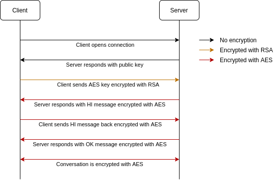

# socket-chat
Python code for a group chat implementation using sockets

## Requirements

- Python 3.8
- [pycryptodomex 3.10.1](https://pypi.org/project/pycryptodomex/) 

## How to run
Server can be initialized by:

```
$ python server.py 
Server is commencing...
Listening at 192.168.1.21:8756
``` 

Client can be initialized by:

```
$ python client.py 
Trying to connect server...
Connected to server.
Encryption is established.
Please enter a username.
Username:
``` 

Client waits for username input and after the username is given, it is sent to server for unique validation. After that,
 conversation can be started. Every message sent by clients will be encrypted and broadcasted to other connected users. 
An example of such conversation can be found below: 
 ```
Username: Randall Flagg
Jaime Lannister: Hi
> Hi
Jaime Lannister: How are you R.F.?
 ``` 

 ```
Username: Jaime Lannister
> Hi
Randall Flagg: Hi
> How are you R.F.?
 ``` 

## Encryption
Implementation uses RSA + AES for encrypting messages between server and client. When client opens connection, server 
creates a public & private key pair (RSA). After that, server sends the public key to client in order to transfer the 
AES key hidden. Client receives the public key and initializes AES key & nonce values. These values are encrypted with 
RSA public key and directly sent to the server. Server decrypts the message using private key and receives the AES key. 
It encrypts a welcoming message, "HI", and sends this message to the client along with the MAC value. Client receives 
the message and MAC value, decrypts the value and checks the MAC validity. MAC value ensures that authentication of the 
message. After this process, client responds the same "HI" message to client encrypted with AES along with its MAC value. 
Server authenticates the MAC value and responds with "OK" message, indicating that server is ready to accept full 
encrypted connections.



An important aspect to be noted here is that since we are using the same nonce value and re-initialize AES cipher for 
GCM mode of operation every time a new message arrives, same message plaintexts will be encrypted into the same 
ciphertexts which is considered a bad practice of design considering crypto systems. If GCM mode is used, counter value 
must be incremented after each encryption which is not the case in this implementation.  

